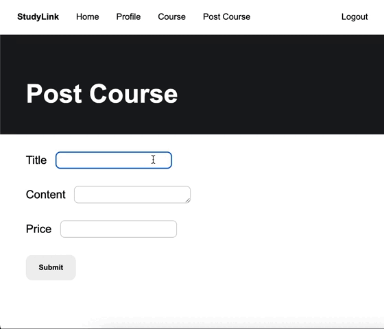
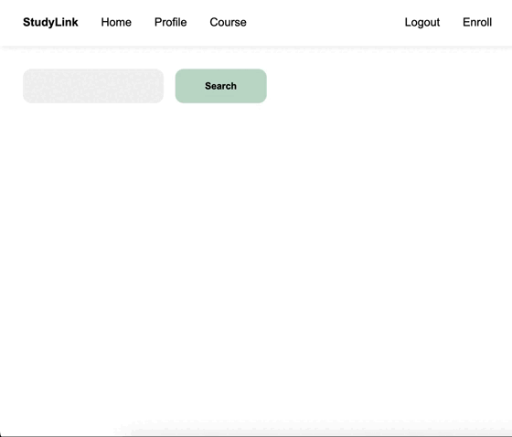

# Online Course Platform

This project is an online course system where teachers can log in to search, create, update, and delete online courses. As a student, you can register for courses. The project includes an account system and uses JWT for user authentication.
 
 
| instructor | student |
| --- | --- |
| |  |

 
 

## Backend Technique

### Environment

- Node.js/Express.js

### Database

- MongoDB Atlas

### Third Party Library

- passport.js
- bcrypt
- joi.js

## Frontend Technique

- HTML
- CSS (SCSS)
- Javascript (React)
- axios

 
 

## Contect

Kai-Lin Yang  
kailinnnnn0408@gmail.com
